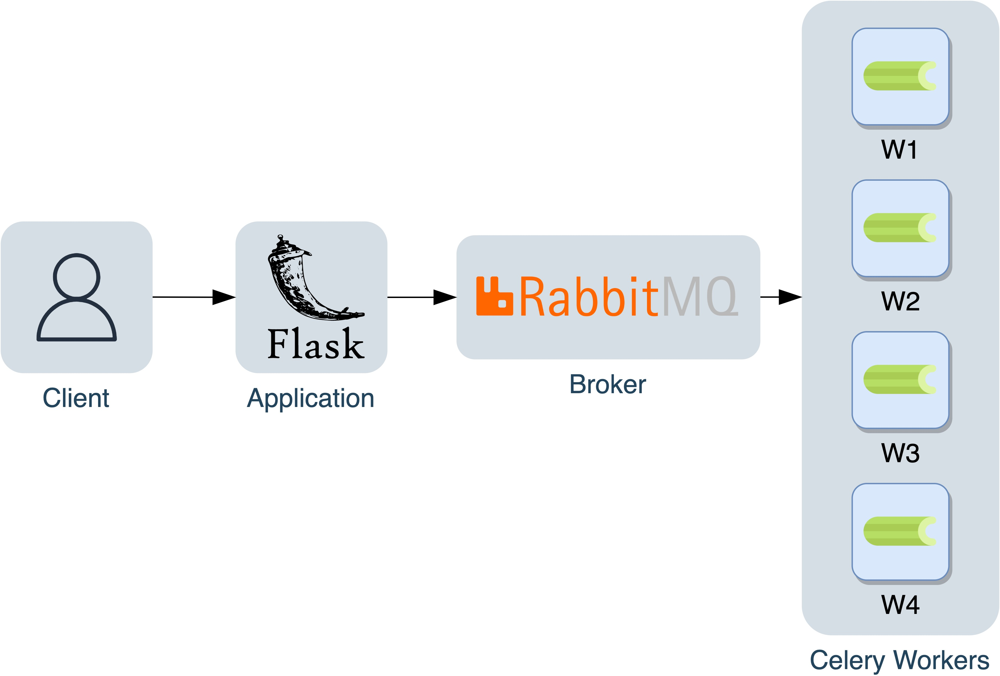

# Airfoil as a Service
The airfoil project is made to work as a cloud service using celery workers, RabbitMQ as the broker, Flask as the application.

<div style="text-align:center"></div>

## Installation
How to install:
```sh
cd murtazo
code code code...
```

bla bla inline code: `docker-compose up`


