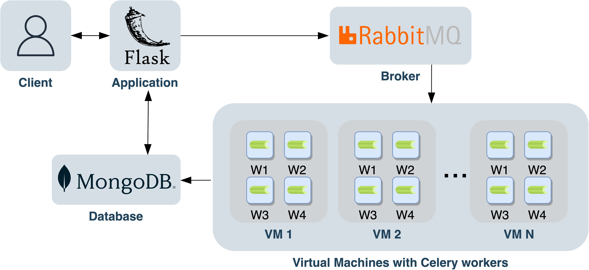

# Airfoil as a Service
The airfoil project is made to work as a cloud service using celery workers, RabbitMQ as the broker, Flask as the application. The results are stored in a MongoDB database.

<div style="text-align:center"></div>

## Starting up with Heat
On your own terminal source the file from your cloud provider
```source UPPMAX 2021_1-5-openrc.sh```

Update heat-file `ssc-heat.yaml` with your key name and the public part of your key.
Have key-file and the `ssc-heat.yaml` in the same folder and run
``` openstack stack create airfoil_stack -f 'yaml' -t ssc-heat.yaml```

Please have patience when setting up the VM! Wait for at least 20 minutes after the HOT has been deployed. Both heat and cloudinit installs necessary packages on the VM and deploys a docker with the airfoil application to run the mesh files with below input. If you wish another set of mesh arguments edit this in `second_step.sh` shell script.
`#ARGUMENTS to runme.sh <angle.start> <angle.stop> <no.of.angles> <no.of.nodes> <no.of.refinement.levels>
 #./runme.sh 0 30 10 200 1`


Go into a web browser and run(obs number of files < N number of workes)
`http://<floating-ip>:5000/home>`


###TODO LIST INNAN VI ÄR KLARA:
- ~~Heat code~~
- ~~Om xml redan körts ska den ta gamla resultatet~~
- Rensa upp lite i githubben
- Skriv instruktioner för hur man startar upp och kör allt
- Rapport: Reusltat
           Metod

